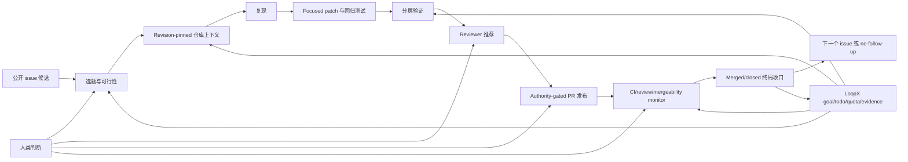

# Issue-Fix 能力

[English](README.md) · [能力目录](../README.md) ·
[工作流协议](protocols/issue-fix-workflow-contract-v0.md) ·
[验收循环](protocols/issue-fix-acceptance-loop-v0.md) ·
[Reviewer 推荐协议](protocols/issue-fix-reviewer-recommendation-v0.md)

Issue-Fix 是 LoopX 把公开仓库 issue 持续推进成小而聚焦、验证充分、可审阅 PR，
并继续跟进到明确 PR 生命周期终局的产品能力。它面向的是一个长程 issue→PR
数字员工，而不是一次性的代码生成器：goal 状态、todo、authority、仓库证据、
validation、reviewer 路由、monitor、人类 gate 和 terminal closeout 都保存在单次
聊天之外。

当 issue 适合修复时，核心产出是 focused fix PR。公开 comment 或有理有据的 triage
仍可用于拒绝不合适候选、澄清信息或记录具体 blocker，但不能在 `fix_pr` 可行时
替代 PR 主路径。

## LoopX 底座提供什么

使用这项能力不要求先了解 LoopX。最短的心智模型是：coding agent 负责理解仓库和修改
代码；LoopX 是 local-first 控制面，负责记住 agent 要达成什么、决定下一步能否运行、
把进度展示给人，并让任务跨聊天轮次和外部等待持续存在。

GitHub 仍然是 issue、代码、checks、review 和 merge state 的事实源。LoopX 补上 host
agent 与 GitHub 之间缺失的“数字员工控制层”：

| LoopX 底座能力 | 在 issue/PR fix 场景中的作用 |
| --- | --- |
| 持久化 goal state | 在一次模型 turn 结束后继续保存 objective、acceptance target、current status、next action 和紧凑 outcome evidence。 |
| Todo ownership 与 routing | 区分 agent 工作和具体人类决策；记录 priority、`claimed_by`、blocker、successor、handoff 和 monitor，避免多个 agent 无声重复做同一任务。 |
| Kanban/status 投影 | 把同一份 todo 事实投影到人可见的看板或 dashboard，但不让看板变成第二套状态机。人可以看到谁负责、产出了什么、在等什么。 |
| Quota 与 scheduler policy | 通过 `quota should-run` 决定现在应执行有界工作、等待、修状态还是安静跳过；unchanged poll 会退避，也不冒充 delivery progress。 |
| Authority 与 interaction gate | 把“技术上能做”与“被允许做”分开。私有材料、公开 comment、push、建 PR、请求 review、merge 和 production action 都可分别要求明确 authority。 |
| Evidence 与 repository context | 把结论固定到 repository revision、source trust、freshness、repo-relative reference、reproduction 和 validation；保留紧凑证据，不把 raw log、凭据或私有正文带进公开状态。 |
| Replan 与 handoff contract | 把 CI failure、reviewer correction、信息缺失或 stale branch 转成 runnable successor、具体 blocker 或有范围的人类问题，而不是让修正消失在聊天里。 |
| Continuous monitor | 跟踪 CI、review、mergeability、maintainer comment、stale branch、merged 和 closed；只写回 material transition，并以明确 outcome 终止。 |
| Public/private boundary check | 扫描公开 artifact，阻止本地路径、credentials、runtime state、raw transcript、tool log 和私有 evidence 进入 commit/PR。 |

Issue-Fix capability 把这些通用底座组合成领域 packet 和 CLI。Host agent 仍负责读代码、
修改 worktree、跑测试，以及执行另行授权的 GitHub 动作。正是这种分工，把“一次性生成
patch”变成可见、可恢复、可持续的 issue→PR 数字员工：

```text
公开 issue
  -> 持久化 goal 与已认领 todo
  -> revision-pinned evidence 与复现
  -> focused patch 与 validation
  -> 可解释 reviewer route 与 authority gate
  -> PR monitor 与 material-transition replan
  -> merged/closed outcome、successor 或明确 no-follow-up
```

## 产品定位

LoopX 是控制面，不是 coding model，也不是 GitHub 本身。

| 层次 | 职责 |
| --- | --- |
| Host agent/runtime | 读代码、复现、修改文件、运行测试，并执行已明确授权的 git/GitHub 动作。 |
| Issue-Fix capability | 生成 public-safe 的 workflow、feasibility、repository-context、reviewer、validation 和 PR-lifecycle packet。 |
| LoopX kernel | 持久化 goal/todo ownership、quota、authority、evidence、monitor、replan 和人机交互状态。 |
| Repository/GitHub | 继续作为代码、仓库政策、CI、review、mergeability 和 PR 终局的事实源。 |
| Human maintainer | 负责设计判断、仓库政策、敏感/私有上下文，以及超出已记录 authority 的动作。 |

Issue-Fix packet builder 不会偷偷发布。只有当前 LoopX boundary 已记录相应 authority，
且仓库政策允许时，host agent 才能创建或更新 PR。Merge 是独立决策，除非也被明确授权。

## 端到端设计



### 1. 候选筛选

第一轮只选一个 issue。优先公开、open、带 traceback、failing test、最小复现、
变更范围可控，并且存在 repository-native focused validation 的问题。避免依赖私有
数据、凭据、生产系统、大型设计争议或宽泛语义变化的候选。

每个候选必须明确选择一条路：

- `fix_pr`：复现和验证可信，范围可控；
- `comment_only`：公开澄清或诊断有价值，但尚不具备安全 patch 条件；
- `triage_only`：证据不足、范围过大，或继续跟进没有实际价值。

长程数字员工的主验收是 `fix_pr`；另外两条路用于保护质量和 maintainer 注意力。

### 2. 以当前仓库为准的理解

Authority 优先级严格为：

1. 当前 checkout 的证据；
2. 仓库范围内的历史 memory；
3. 外部 expert/bot 建议。

在 pinned revision 阅读仓库政策、架构、附近源码和测试、验证命令以及近期相关修复，
再压缩成 `issue_fix_repository_context_input_v0`：包含 revision、repo-relative
source ref、证据类别、source trust 与 freshness。Memory/expert 只作 advisory，
影响 patch 的结论必须在当前 checkout 验证。

### 3. 先复现，再修改

不要把所有失败都解释成产品 bug，要区分：

- 产品 bug 已复现；
- 测试或 fixture bug；
- 环境/依赖失败；
- issue 信息仍不足或当前无法复现。

如果条件允许，先让现有 focused test 因报告中的 contract 失败，再改生产代码。
只记录紧凑的 pass/fail 和命令标签，不记录 raw log 或本地路径。

### 4. Focused patch 与回归证明

从最新获批 base revision 创建干净 worktree 和独立分支。补丁保持小、可解释，
遵循附近代码模式；新增或调整一个“没有修复就会失败”的 focused test。验证范围随风险
逐步扩大，而不是一开始就跑无边界的全仓测试。

### 5. Reviewer 推荐

Reviewer 路由属于控制面，因为 patch 正确但 reviewer 找错，同样会让 PR 长期停滞。
LoopX 现在提供：

```bash
loopx issue-fix reviewer-plan \
  --repo-path /path/to/approved/repo \
  --repo owner/repo \
  --base-ref origin/main \
  --exclude-reviewer @pull-request-author \
  --exclude-author-name "PR Author Git Name" \
  --execute \
  --format json
```

当前证据优先级刻意保持保守：

1. 每个改动路径命中的仓库 `CODEOWNERS`；
2. 改动文件本身的提交历史；
3. 新文件没有可用 path history 时，回退到最近 module 目录的提交历史。

Packet 输出候选的 source kind、reason code、改动路径覆盖、history 次数、recency、
confidence，以及是否真的有可请求的 GitHub handle。它不保存 commit email，
不记录本地 repo path，也不会自动发送 review request。调用方应排除 PR author 和已知
不可用 reviewer。History 固定读取 base revision，避免 feature branch 自己的提交把
作者推荐回来；`--exclude-author-name` 用于排除无法解析成 GitHub handle 的 git-name
alias。

`CODEOWNERS` 是最强的 repository-native 信号。提交量只说明“可能熟悉”，不代表
maintainer 身份、可用性或 review authority。评分、身份解析与未来信号详见
[Reviewer 推荐协议](protocols/issue-fix-reviewer-recommendation-v0.md)。

### 6. PR 发布与公开写边界

外部写入前应准备 public-safe package：

- 问题与根因；
- 有边界的 diff 摘要；
- focused 与扩大验证；
- 风险和未覆盖项；
- reviewer 证据；
- PR body/comment 草稿。

PR 创建、公开 comment、push、merge 和 publish 都是外部写操作。Host agent 只能
执行当前 boundary authority 覆盖的动作；recommendation packet 始终保持只读。

### 7. 持续 PR 生命周期

PR 存在后，创建带稳定 target 和 cadence 的 `continuous_monitor` todo。
`loopx issue-fix pr-lifecycle` 把紧凑的公开 PR metadata 投影成四种决策：

- `runnable_successor`：CI 失败、review 请求修改，或分支需要可执行 replan；
- `monitor_continuation`：checks/review 仍在等待，或没有 material change；
- `user_gate`：需要明确的人类决策；
- `no_followup`：PR 已 merged/closed，monitor 可以终止。

相同 poll 不应制造工作、消费 delivery quota 或打扰 maintainer。Material transition
必须生成 successor、具体 blocker 或结构化 no-follow-up；agent 不能静默停在
monitor-only。

### 8. Terminal closeout 与可重复性

到 merged/closed 状态后，持久化紧凑 lifecycle evidence、关闭 monitor、同步管理面、
记录剩余风险，并选择：

- 下一个 issue；
- 明确 rollout/follow-up todo；
- blocker 或 superseding route；
- 结构化 no-follow-up。

一个 merged PR 证明一次 delivery slice；在独立 issue 上重复，才能证明它是稳定数字
员工，而不是 scripted demo。

## 已实现能力面

| 能力面 | 命令或路径 | 当前职责 |
| --- | --- | --- |
| Workflow plan | `loopx issue-fix workflow-plan` | 组合 body-free metadata、intake、branch plan、validation label、todo preview、gate 和 PR-readiness blocker。 |
| Repository context | `--repository-context-json` | 用 trust/freshness 固定 policy、architecture、change-scope、reproduction 和 validation 证据。 |
| Feasibility | `loopx issue-fix feasibility` | 在 `fix_pr`、`comment_only`、`triage_only` 中只选一条，并可写入紧凑 domain state。 |
| Reviewer plan | `loopx issue-fix reviewer-plan` | 从 CODEOWNERS 与改动 path/module history 生成可解释候选，但不请求 review。 |
| PR lifecycle | `loopx issue-fix pr-lifecycle` | 把 CI、review、merge state、draft、merged、closed 信号投影为 monitor transition。 |
| Acceptance fixture | `loopx issue-fix acceptance-fixture` | 在 deterministic fixture 中证明 failure-before、minimal patch、pass-after。 |
| Git branch fixture | `loopx issue-fix repo-branch-fixture` | 在临时 git branch 中运行同一修复 contract。 |
| Caller repo branch | `loopx issue-fix caller-repo-branch` | 检查获批本地 repo、创建/认领 issue branch、运行 caller-declared validation。 |
| Content bridge | `loopx content-ops issue-fix-*` | 复用 body-free public metadata/intake 边界。 |
| 长程控制 | `loopx todo`、`quota`、`refresh-state`、`lark-kanban` | 保存 ownership、gate、compute 决策、进度、evidence 和可见 Kanban。 |

Capability module 位于 `loopx/capabilities/issue_fix/`。Domain state 复用现有
issue-fix domain pack，不额外创建平行 context ledger。

## Truth 与 Evidence 模型

### Revision-pinned repository context

Repository context 应回答：

| 问题 | 必需证据 |
| --- | --- |
| 哪个 revision 有权威性？ | 完整 base revision 与 branch 关系。 |
| 哪些文件可变？ | Repo-relative source/test ref 与附近实现模式。 |
| 如何复现？ | Focused command 或紧凑 observed contract。 |
| 如何验证修复？ | Repository-native focused validation 与风险驱动的扩大验证。 |
| 哪种 source 更可信？ | 仓库政策/当前代码优先，memory/expert 标为 advisory。 |
| 证据是否新鲜？ | Revision 或 timestamp 与当前 checkout 绑定。 |

### Public-safe evidence

Packet 保存紧凑分类和 reference，不保存：

- 默认不复制 raw issue/comment body；
- raw validation、git、provider 或 expert 输出；
- 本地绝对路径；
- credentials 或私有材料；
- 未获批准的 transcript/tool 自动捕获或 memory writeback。

### 环境问题与产品问题分离

依赖缺失、进程被 kill、服务不可用属于环境证据，可能阻塞某个 validation surface，
但不能自动推翻产品 bug。反过来，legacy test 失败也不能证明新 patch 有问题；必须对比
pinned base 与改动 hunk 后再归因。

## Reviewer 路由 Contract

Reviewer recommendation 明确拆开三个概念：

1. **ownership evidence**：CODEOWNERS 与 path/module contribution history；
2. **review recommendation**：可解释的排序候选；
3. **review request**：受仓库政策和 boundary authority 管理的外部写操作。

当前评分让 CODEOWNERS 占主导权重，再使用 recency-weighted commit history。新文件仅在
没有可用 exact-path history 时回退到最近 module 目录。Packet 输出 reason，不把分数
伪装成 authority。

重要防护：

- 排除 PR author 和明确不可用 reviewer；
- 不暴露 commit email；
- bot、匿名身份或未解析 name 不得视为 requestable；
- 限制候选数量并展示 path coverage；
- team handle 与个人 handle 分开；
- 排序之外仍遵守 required-review 与 branch-protection policy；
- 不从代码熟悉度推断 merge authority。

只有出现真实 call site 和 public-safe evidence 后才加入的规划信号：

- CODEOWNERS 之外的 package/module maintainer metadata；
- 最近 review 参与和 accepted-review history；
- reviewer load、stale request 与 fallback routing；
- 关键 module 由单人主导时的 bus-factor 风险；
- 无 noreply handle 的公开 git author 到 GitHub identity 的解析；
- 仓库显式 allow/deny list 与 team membership 验证。

## 人机交互模型

人应当为判断被打扰，而不是为例行进度被打扰。典型 user gate：

- 需要私有复现材料或凭据；
- architecture/behavior scope 确实存在歧义；
- 仓库政策要求特定 reviewer 或 owner approval；
- 缺少公开写 authority；
- maintainer feedback 改变预期行为；
- merge/production authority 未记录。

CI pending、相同 monitor poll、例行 reviewer 证据收集和 repository-native focused
validation 都属于 agent 工作。可见 Kanban 可以投影 todo ownership、status、evidence、
blocker 和 output，但不能成为第二个事实源。

## 公开 Pilot 证据

第一个公开端到端 pilot 选择了
[OpenViking issue #3102](https://github.com/volcengine/OpenViking/issues/3102)，
发布 focused fix，通过必需 CI 和 review，最终进入
[merged PR #3115](https://github.com/volcengine/OpenViking/pull/3115)。该案例验证了
host-agent 周边的 revision-pinned context、复现、focused validation、authority-gated
发布、持续监控、terminal closeout、Kanban 可见性和 successor planning。

Pilot 还在 [PR #1784](https://github.com/huangruiteng/loopx/pull/1784) 中形成了通用
LoopX 控制面反馈。在对应通用改动合并前，pilot 证据只作为产品设计建议；当前仓库
revision 仍是事实源。

## Roadmap

### 当前阶段

- 公开 metadata 与 route selection；
- repository-context provenance；
- deterministic/caller-repo repair artifact；
- focused validation evidence；
- 基于 repository-native ownership evidence 的 reviewer recommendation；
- PR lifecycle projection；
- host agent 驱动的 LoopX todo/quota/monitor/Kanban 集成。

### 下一阶段

- 把 reviewer recommendation 接入 PR-ready 和 lifecycle packet；
- 在不泄露 email 的前提下解析公开 GitHub identity 与 repository team；
- 按外部动作显示 publication authority；
- 让相同 lifecycle observation 在所有路径上物理幂等；
- 把 maintainer correction 投影成明确 patch/blocker successor；
- 跨重复 issue 生成统一 terminal acceptance report。

### 更长期

- 多仓库 issue portfolio 与有界并发；
- 从公开 accepted/rejected outcome 学习 maintainer preference；
- reviewer load balancing 与 bus-factor awareness；
- 带显式 workspace/peer 隔离的 richer repository memory；
- repository-context contract 稳定后的 Open Knowledge Format 互操作；
- accepted fix、cycle time、human attention、regression、boundary incident 等项目级指标。

## 成功指标

衡量 outcome，而不是 agent 活跃度：

- 选中 issue 到 focused PR 的比例；
- focused PR accepted/merged 比例；
- failure-before/pass-after 证明率；
- 无关 regression 率；
- issue selection 到 review-ready/terminal 的时间；
- 人工介入次数和类型；
- reviewer recommendation 接受/覆盖率；
- 跳过的 unchanged monitor poll；
- public/private boundary incident；
- pilot 暴露的通用 LoopX gap 是否修复或转成具体 claimed todo。

## 对话式 `/loopx` 入口

Host 已提供 LoopX slash entry 时，直接启动长程目标：

```text
/loopx Fix https://github.com/owner/repo/issues/123
```

手工集成的 host 先查看 command pack，再用完全相同的目标文本启动 guided CLI
transaction：

```bash
loopx bootstrap-command-pack --project .
loopx start-goal --guided --project . \
  --goal-text "Fix https://github.com/owner/repo/issues/123"
```

对话入口不会跳过 issue 筛选、authority 或 validation；它负责创建持久化的
goal/todo/host-loop 路由，后续再执行下方 issue-fix 命令。

## Feasibility 决策

`loopx issue-fix feasibility` 必须在 `fix_pr`、`comment_only`、`triage_only`
中唯一选择一条 route。`fix_pr` 需要 bounded change scope，以及明确命名的
reproduction 和 validation surface。应先把紧凑决策写入现有 issue-fix domain state，
再为选定 route 写 todos；不要另建并行 workflow ledger。

## Repository Context

Workflow plan 与 feasibility 都接受
`--repository-context-json <compact-context.json>`。输入必须 pin 当前 revision，并使用
repo-relative source ref。当前 checkout 证据保持最高权威；memory/expert 结论在当前
仓库验证前只作 advisory。公开的
[OpenViking pilot handoff](openviking-pilot-handoff.md) 展示真实 pilot 如何应用该证据
顺序，同时不引入仓库特判控制路径。

## PR Lifecycle Monitor

发布后，`loopx issue-fix pr-lifecycle` 与 `continuous_monitor` todo 持续跟踪 CI、
review、maintainer correction、mergeability、stale branch 和 terminal status。
发布、review request、merge 与读取私有材料继续作为 explicit gate。每次 material
transition 必须生成 `runnable_successor`、具体 blocker 或结构化 no-follow-up；
unchanged poll 保持安静且不消耗 delivery quota。

## 命令

```bash
# 预览完整 issue-fix workflow。
loopx issue-fix workflow-plan \
  --url https://github.com/owner/repo/issues/123 \
  --repo-path /path/to/approved/repo \
  --repository-context-json context.json \
  --validation-label "focused unit test" \
  --format json

# 选择唯一 route，并持久化 goal-scoped feasibility state。
loopx issue-fix feasibility \
  --url https://github.com/owner/repo/issues/123 \
  --reproduction-status confirmed \
  --reproduction-label "focused contract repro" \
  --scope-class bounded \
  --validation-label "focused unit test" \
  --repository-context-json context.json \
  --goal-id example-goal \
  --format json

# 推荐 reviewer，但不发送外部 review request。
loopx issue-fix reviewer-plan \
  --repo-path /path/to/approved/repo \
  --repo owner/repo \
  --base-ref origin/main \
  --exclude-reviewer @pull-request-author \
  --exclude-author-name "PR Author Git Name" \
  --execute \
  --format json

# 把 PR lifecycle 投影到 LoopX continuation state。
loopx issue-fix pr-lifecycle \
  --url https://github.com/owner/repo/pull/456 \
  --fetch-metadata \
  --goal-id example-goal \
  --format json
```

## Validation

```bash
python3 examples/issue-fix-capability-guide-smoke.py
python3 examples/issue-fix-reviewer-recommendation-smoke.py
python3 examples/issue-fix-workflow-plan-smoke.py
python3 examples/issue-fix-workflow-contract-smoke.py
python3 examples/issue-fix-repository-context-smoke.py
python3 examples/issue-fix-feasibility-smoke.py
python3 examples/issue-fix-pr-lifecycle-smoke.py
python3 examples/issue-fix-acceptance-loop-smoke.py
loopx canary premerge --from-git-diff
```

## 非目标

- LoopX 不绕过 repository review 或 branch protection。
- Reviewer recommendation 不等于 reviewer assignment 或 availability proof。
- 默认不自动 merge，也不执行 production action。
- Public state 不保存 raw transcript、tool log、expert answer、credentials 或私有 issue material。
- Generic control plane 不加入 `if repo == ...` 一类仓库特判。
