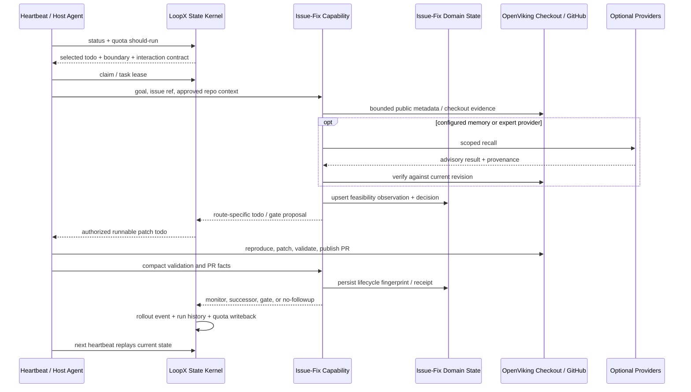

# OpenViking PR / Issue Fix：State Kernel 与垂域状态如何协同

[返回 Issue-Fix 能力](README.zh-CN.md) ·
[工作流协议](protocols/issue-fix-workflow-contract-v0.md) ·
[长程 Agent 状态协议](../../reference/protocols/long-horizon-agent-state-protocol-v0.md)

## 结论

OpenViking PR / Issue Fix agent 能跨 turn 完成选题、复现、修复、发 PR、找 reviewer、
处理 CI/review 并收口，不是因为 LoopX 把 GitHub 工作流硬编码进了 State Kernel，而是因为
两层状态之间存在一条窄而可回放的联动边界：

- **State Kernel 决定“谁现在可以在什么边界内做哪一步”**。它拥有 goal、todo、
  claim/lease、authority、user gate、quota、scheduler、monitor、run history、reward、
  handoff 和 terminal closeout；它不理解 `CHANGES_REQUESTED` 或 `merge conflict` 的业务含义。
- **Issue-Fix 垂域状态记录“这个 issue / PR 在领域上已经被观察和判断成什么”**。它保存
  feasibility、revision-pinned repository context、PR lifecycle、reviewer notification receipt
  和 outcome 所需的紧凑事实；它不能自行获得写仓库、发消息、建 PR 或 merge 的权限。
- **Issue-Fix capability 负责翻译**。它把 GitHub / repository 事实压缩成领域 observation，
  再把领域 transition 映射成通用 `advancement_task`、`continuous_monitor`、`user_gate` 或
  `no_followup`。它可以提出下一步，但最终仍由 Kernel 的 authority、workspace、quota 和
  lease 合同决定是否执行。
- **Repository / GitHub 仍是外部事实源**。代码、issue、checks、review、mergeability 与
  terminal PR state 不因被写进 LoopX 就改变。LoopX 保存的是有 provenance 的紧凑状态，
  不是 GitHub 的镜像。

可以把这套关系概括为：

> Kernel 管控制权，Domain State 管领域连续性，Capability 管二者之间的翻译，Provider
> 管可替换的外部 I/O；任何 projection 都只负责展示。

## 一、先分清四种对象

“垂域状态扩展”“capability”和“extension”经常被混为一谈。它们在 LoopX 中不是一回事。

| 对象 | 回答的问题 | Issue-Fix 中的例子 | 不拥有的东西 |
| --- | --- | --- | --- |
| State Kernel | 哪个目标、todo、agent、边界和时间片现在有效？ | `goal_id`、`todo_id`、`claimed_by`、task lease、decision scope、quota、monitor cadence、run history | issue 分类、PR review 语义、GitHub 真相 |
| 垂域状态 / domain pack | 某个领域对象最新的紧凑观察、判断和关联是什么？ | `issue_fix/feasibility.jsonl`、`issue_fix/pr-lifecycle.jsonl`、repository snapshot | 调度、算力、全局 ownership、外部写权限 |
| Product capability | 为调用方完成什么稳定结果？ | 从公开 issue 推进到 focused PR 和明确 terminal outcome | 长期保存全部语义、隐式扩大权限 |
| Provider extension | 哪个可选实现来提供外部读取、发送、归档或记忆？ | Lark notification sink、OpenViking semantic-preference provider | capability 的产品语义、Kernel 的控制权 |

因此，`loopx/domain_packs/issue_fix.py` 是 **Issue-Fix 垂域状态的内建状态适配层**；它不是
一个可独立启停的 LoopX extension。`loopx/capabilities/issue_fix/` 是产品能力实现；
`loopx/extensions/` 才是 provider 的注册、启停、doctor 和兼容边界。

一个 provider 可以缺席而 capability 仍然成立。例如 OpenViking Memory 未配置时，
Issue-Fix 仍可依靠当前 checkout 完成复现和修复；Memory 命中只提供候选上下文，而且必须回到
当前 revision 验证。反过来，一个 provider 也不能绕过 capability 直接赋予 agent 发布权限。

## 二、边界：哪些状态必须留在 Kernel

### Goal 与 todo 是控制面的事实

LoopX runtime 没有第二种“issue task”。一个 issue 要进入执行，先被翻译成普通
`todo_item_v0`：

```json
{
  "todo_id": "todo_<stable-id>",
  "task_class": "advancement_task",
  "action_kind": "issue_fix_patch",
  "task_repository": "git:github.com/volcengine/OpenViking",
  "required_write_scopes": ["openviking/**", "tests/**"],
  "required_capabilities": ["shell", "filesystem_write", "git"],
  "claimed_by": "<registered-peer>"
}
```

这里的 `action_kind` 可以是领域 token，但 todo 的 open/done/blocked/deferred、claim、
successor、resume、evidence 和 continuation policy 都由通用 Kernel 解释。这样 quota、status、
dashboard、handoff 和多 agent 协作不需要 import Issue-Fix 代码。

### Claim、lease 与 authority 不能下沉到领域状态

`claimed_by` 只是软路由；并发写入需要 `(goal_id, todo_id)` 粒度的 `task_lease_v0`，
repository delivery 还要通过 workspace guard。二者都不等于权限：

- lease 解决“两个 peer 会不会同时写同一任务”；
- write scope 解决“这个任务声明要改哪些相对路径”；
- authority 解决“当前用户是否允许公开写、发 reviewer 通知、merge 或访问私有材料”；
- capability token 解决“当前运行环境是否真的有 shell、network、GitHub CLI 等执行条件”。

如果把这些字段复制进 `pr-lifecycle.jsonl`，很快会出现两份 ownership、两份权限和两份过期
时间。Issue-Fix domain state 因而只保留领域观察和已验证 receipt，不自授 authority。

### Quota 与 scheduler 只调度通用 work lane

Kernel 的 `quota should-run` 选择的是：

- 可执行的 `advancement_task`；
- 到期且 capability 可用的 `continuous_monitor`；
- 需要具体人类决定的 `user_gate`；
- workspace / state / capability repair；
- 或无变化时安静等待。

它不需要知道 CI 的每一种状态。Issue-Fix capability 先把 `pending checks` 翻译成
`monitor_continuation`，把 `failing checks` 翻译成 `runnable_successor`；Kernel 再按统一规则
判断本轮运行、等待、退避还是询问用户。

## 三、边界：哪些状态属于 Issue-Fix domain pack

通用 `loopx/domain_state.py` 只提供稳定 key、文件锁、临时文件替换和幂等 upsert。真正的
Issue-Fix 语义留在 `loopx/domain_packs/issue_fix.py`。

当前主要有三类领域流：

| 领域流 | 稳定 key | 保存什么 | 不保存什么 |
| --- | --- | --- | --- |
| `feasibility` | `repo + issue_ref` | `fix_pr / comment_only / triage_only`、repro 状态、scope、validation label、repository context、observation fingerprint | raw issue/comment body、raw log、local path、credential |
| `pr-lifecycle` | `repo + pr_ref` | PR state、checks rollup、review decision、merge state、显式 `issue_ref`、material transition、verified notification receipt | raw review body、raw check log、provider response |
| `repository-snapshots` | `repo + snapshot_date` | 有物质变化的有界公开 stock/flow fingerprint | GitHub 全量镜像、私有仓库数据 |

领域行是**可重算、可比较、可幂等覆盖的紧凑 materialized state**。例如
`upsert_issue_fix_pr_lifecycle_ledger_jsonl()` 会比较 observation fingerprint；相同的 quiet
poll 不重复写入，同时保留已验证的 reviewer notification receipt 和首推 CI 证据。

这层状态的价值不是代替 GitHub，而是让下一轮 agent 不必从聊天记录猜：这个 issue 是否已判定
可修、哪个 PR 与它显式关联、上一次看到的是 CI pending 还是 changes requested、通知是否已经
被验证送达。

## 四、联动机制：两条单向桥，而不是共享一团状态

### Kernel → Issue-Fix：给领域能力一个受约束的执行上下文

Kernel 向 capability 提供：

1. `goal_id` 与 `todo_id`，确定本次写回属于哪个长期目标和工作单元；
2. `task_repository`、write scope、workspace guard 与 lease，确定 checkout 和并发边界；
3. authority / decision scope，确定本轮哪些外部动作已获批准；
4. runtime capability 与 quota decision，确定本轮能否读取网络、写文件、运行测试或发送通知；
5. compact prior evidence 与 run history，避免重复完成已经闭环的步骤。

Capability 不应把这些输入永久复制成自己的控制面，只在当前 packet 和领域写回中保留必要的
provenance 或 hashed receipt。

### Issue-Fix → Kernel：把领域 transition 翻译成通用工作

Issue-Fix 向 Kernel 返回有限几种 transition：

| 领域观察 | capability 判断 | Kernel 写回 |
| --- | --- | --- |
| issue 已复现、范围有界、有 focused validation | `fix_pr` | 一个 patch `advancement_task` |
| 需要私有 repro 或公开写 authority | concrete blocker | 带 `decision_scope` 的 `user_gate` |
| checks pending、无物质变化 | `monitor_continuation` | 一个按 bucket 聚合的 `continuous_monitor` |
| checks failing / branch conflict | `runnable_successor` | 一个修 CI / rebase 的 advancement successor |
| changes requested 且尚未处理 | `runnable_successor` | 一个 review correction successor |
| newer repair commit 已覆盖反馈且 threads 全 resolved | `monitor_continuation` | 等待 re-review，不重复生成 patch |
| PR `MERGED` 或 `CLOSED` | `no_followup` / terminal transition | 完成 monitor，恢复显式 successor 或记录 no-follow-up |

这里最重要的设计是：**domain transition 不是直接执行指令**。它只是生成 typed proposal；
todo writer、gate scope、quota、authority 与 scheduler 仍会再次检查。

## 五、以一次 OpenViking Issue-Fix 运行为例



### 1. 唤醒与选题

Heartbeat 只负责唤醒。它先读 registry、active state、status、recent history 和
`quota should-run`，再领取一个 `issue_fix_*` todo。选题逻辑可以查看领域状态以排除已 terminal
或已有实现 PR 的候选，但是否可运行仍以 Kernel 输出为准。

### 2. Feasibility checkpoint

`build_issue_fix_feasibility_packet()` 把公开 issue reference、reproduction、scope、validation
和 revision-pinned repository context 压缩成 observation；随后只选 `fix_pr`、
`comment_only`、`triage_only` 之一，并生成 fingerprint。

成功 packet 可按 `repo + issue_ref` 写入 `feasibility.jsonl`。写回之后才把 route-specific
successor 写成正式 LoopX todo。这样“分析结论”和“可调度工作”不会混成一个字段。

### 3. 执行 focused fix

Host agent 在 lease 和 write scope 内创建干净 worktree，完成 failure-before、最小 patch 与
pass-after。代码、测试与 git commit 留在 repository；LoopX 只保留 repo-relative 文件、
revision、validation label、exit status 和可恢复 ref 等紧凑证据。

如果 capability 建议发 PR，而公开写 authority 尚未记录，Kernel 创建 user gate；它不会因为
patch 已通过测试就默认发布。反之，持续 authority 已存在时，agent 无需重复询问。

### 4. Reviewer 与外部通知

Reviewer recommendation 是领域计算，review request 是外部动作。`reviewer-request` 先排除
PR author 和已有覆盖，再检查 authority，执行 provider call，并从 GitHub 或 fallback comment
做精确回读。只有验证成功后，domain state 才保存 `sha256:` receipt；重试读取 receipt 后不得
重复通知。

Lark 等消息 sink 是可选 provider。它可以提升 reviewer 触达，但不能改变 GitHub review
truth，也不能自己推进 todo。发送、writeback、ACK 的顺序必须保证 crash 后仍可重试且不会把
“调用成功”误报成“对端已收到”。

### 5. PR lifecycle monitor

`build_issue_fix_pr_lifecycle_monitor_packet()` 读取有界 PR metadata，生成 observation fingerprint，
再用 `_decide_transition()` 把领域状态压缩为通用 transition。终局状态优先于陈旧 review
metadata；CI pending 只继续 monitor，CI failure 和未处理的 changes requested 才生成新工作。

多个同类 PR 不需要一 PR 一 monitor。`issue_fix_pr_grouped_monitor_projection_v1` 按仓库和
lifecycle bucket 聚合，Kernel 只调度非空 bucket 的一个 monitor；真正的 patch 仍是独立的一次性
advancement todo。

### 6. Terminal closeout 与继续运行

当 GitHub 回读为 `MERGED` 或 `CLOSED`，capability 产生 terminal transition。Kernel 完成 monitor，
追加幂等 rollout event，写回 compact run history，并按显式 `resume_when=pr_merged:...` 恢复
successor；没有后续价值时记录 structured no-follow-up。

下一次 heartbeat 重新从 Kernel source state 开始，而不是从上一段对话继续猜。这就是长程任务
能够在模型上下文、线程和 executor 都变化后仍然继续的关键。

## 六、一次 transition 的三份不同证据

同一个“PR 已合并”会同时出现在三层，但含义不同：

```text
GitHub: PR state = MERGED
    │  外部权威事实
    ▼
Issue-Fix domain state: observation + fingerprint + explicit issue_ref
    │  紧凑领域连续性
    ▼
LoopX Kernel: monitor done + pr_merge rollout event + successor resume
       控制面 transition
```

- GitHub 证明世界发生了什么；
- domain state 证明 agent 观察到了哪个具体对象和哪版事实；
- Kernel 证明这条事实对当前 goal 的工作路由产生了什么结果。

缺一层时应 fail closed：GitHub 已合并但没有精确关联，不能猜 issue；domain state 已写入但 todo
未完成，不能声称控制面已收口；dashboard 已显示 merged 但 source state 没有 transition，不能从
UI 反向修改事实。

## 七、投影只读：看板、Graph 和报告不获得新权力

`build_issue_fix_outcome_collection_from_domain_state()` 从 feasibility 与显式关联的 PR lifecycle
行派生 outcome collection。它明确声明：

```json
{
  "writes_source_state": false,
  "creates_parallel_state_machine": false,
  "external_reads_performed": false,
  "external_writes_performed": false
}
```

status、Kanban、Explore Graph 或 periodic report 可以消费这份 projection，并通过各自 provider
写入远端展示面；它们不能反向变更 feasibility、todo 或 GitHub state。远端写入需要独立
idempotency key 和 exact row/result-id readback，失败则保留 retry/successor，不能只凭 HTTP
成功就宣称交付完成。

## 八、真实运行中最容易犯的边界错误

| 错误 | 为什么危险 | 正确做法 |
| --- | --- | --- |
| 把 PR lifecycle 做成第二套 todo 状态机 | Kernel 与领域层会分别认为自己拥有 ownership 和 terminal | 领域层只输出 transition；正式工作都写回通用 todo/gate |
| claim 后直接写仓库 | claim 只是路由，不是并发锁和权限 | lease + workspace guard + write scope + authority 分别校验 |
| memory 命中直接决定 patch | 历史结论可能过期或属于别的 revision | 命中只作 advisory，回到当前 checkout 验证 |
| checks pending 反复生成 todo | 无物质变化会制造工作噪音和 quota 浪费 | 保存 fingerprint，保持 grouped monitor，unchanged poll 不算 delivery |
| 把 reviewer 消息发送成功当成送达 | retry 可能重复 @ 人，进程 crash 会丢状态 | 远端回读后保存 hashed receipt，再 ACK / closeout |
| 从 branch、title 或 prose 猜 issue 关联 | 容易把两个公开对象合并成错误 case | 只接受显式 `repo + issue_ref` 关联 |
| 看板状态被人工改成 done 后反向收口 | projection 会变成第二事实源 | 看板保持只读；通过 LoopX lifecycle command 写 source state |
| monitor-only / 停工模式仍创建新 patch | 观察被误当成 advancement | Kernel work mode 过滤 advancement，只允许到期 monitor 和 material writeback |

## 九、把同样模式扩展到新的垂域

新增垂域状态时，先回答下面九个问题，而不是先建目录：

1. **领域对象是谁？** 定义稳定 identity，例如 `repo + issue_ref`，禁止从 prose 猜 key。
2. **外部事实源是谁？** 明确哪些字段来自 GitHub、数据库、仓库或人工决定。
3. **需要跨 turn 保留什么？** 只留会影响下一次判断的 compact observation、decision、fingerprint
   与 receipt。
4. **哪些绝不能进入领域状态？** raw body/log、credential、local path、私有材料和可重建的大对象。
5. **领域 transition 有哪些？** 收敛到通用 advancement、monitor、gate、blocker、no-follow-up，
   不自建 scheduler。
6. **如何幂等？** 定义 stable key、observation fingerprint、unchanged 规则和 crash-safe upsert。
7. **如何精确回读？** 外部写入必须有 provider receipt、remote readback 和失败 successor。
8. **capability 与 provider 如何分层？** 产品结果进入 capability；可选 I/O 实现进入 extension；
   领域状态不是因为“可扩展”就自动成为 extension。
9. **如何证明不是第二事实源？** 加 projection contract、negative tests，并验证关闭 provider 后
   Kernel 与核心 capability 仍能工作。

最小代码形态通常是：

```text
loopx/domain_packs/<domain>.py          # 紧凑领域 key、upsert 与 receipt 规则
loopx/capabilities/<capability>/        # packet、transition、CLI 与 validator
loopx/extensions/<provider>/            # 可选 provider manifest/runtime
docs/capabilities/<capability>/         # 产品语义、边界和真实用法
examples/<capability>-*-smoke.py        # 幂等、非法状态、真实 callsite 回归
```

只有当产品结果有稳定 caller contract、真实入口和 focused validation 时，才应新增 capability；
只有当 provider 需要独立安装、启停、兼容和生命周期管理时，才应新增 extension。否则优先复用
最近的现有 owner，避免把目录结构误当架构。

## 十、代码导航

| 关注点 | 当前实现 |
| --- | --- |
| 通用 domain-state stable-key upsert | `loopx/domain_state.py` |
| Issue-Fix domain keys、ledger 与 notification receipt | `loopx/domain_packs/issue_fix.py` |
| Todo / gate / successor / resume contract | `loopx/control_plane/todos/` |
| Per-todo lease 与 write-scope conflict | `loopx/control_plane/work_items/task_lease.py` |
| Quota 与 interaction contract | `loopx/control_plane/quota/`、`loopx/control_plane/work_items/interaction_contract.py` |
| Feasibility observation 与 route | `loopx/capabilities/issue_fix/feasibility.py` |
| PR lifecycle observation 与 transition | `loopx/capabilities/issue_fix/pr_lifecycle.py` |
| Reviewer request、回读与 receipt | `loopx/capabilities/issue_fix/reviewer_request.py`、`reviewer_notification_drain.py` |
| 只读 outcome projection | `loopx/capabilities/issue_fix/outcome_projection.py` |
| 幂等公共 rollout event | `loopx/rollout_event_log.py` |

这套分层的 claim boundary 很明确：LoopX 可以证明“在已记录边界内，一个被领取的工作经过
验证与写回后推进了”；它不能仅凭 agent 输出证明 GitHub、reviewer 或用户已经接受结果，也不能
把某个成功 pilot 自动推广成所有垂域的默认策略。
