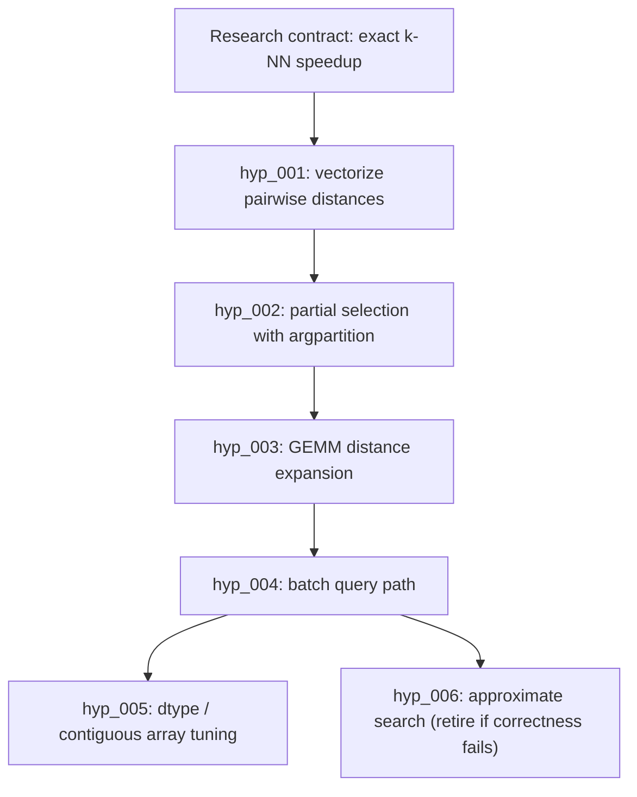

# Decentralized Auto-Research Showcase Blueprint

This note turns the Arbor review into a LoopX product path. Arbor's public
showcase is strong because it is concrete: a benchmark, a hypothesis tree,
dev/held-out scores, replayable events, and a final report. LoopX should aim
for the same clarity while keeping its own architecture: decentralized agents
over one shared control plane, not one leader Coordinator.

## What Arbor Demonstrates

Arbor's public materials show a repeatable autonomous research loop:

- a Research Contract that names objective, editable files, protected harness,
  metric, budget, and review mode;
- an Idea Tree where hypotheses record status, evidence, score, branch, retry
  status, grounding, and related-work audit;
- isolated executor worktrees for each experiment;
- a dev metric for iteration and a held-out metric for promotion;
- replay/report/export surfaces that make the run inspectable;
- a benchmark zoo, including `algotune_knn`, that is small enough for a user to
  watch end to end.

The Arbor `algotune_knn` demo is especially useful for LoopX because it is
public-safe, deterministic, CPU-only, and easy to explain: optimize a k-nearest
neighbors solver without editing the protected evaluator. Arbor reports an
example six-cycle improvement from roughly baseline speed to multi-x speedup,
with held-out validation.

## LoopX Adaptation

LoopX should reproduce the product value, not the topology.

| Arbor shape | LoopX version |
| --- | --- |
| Coordinator-mediated tree management. | Kernel-owned evidence graph plus per-agent frontier projections. |
| Executors receive ideas from Coordinator. | Agents claim todo-backed hypotheses through `quota should-run --agent-id`. |
| Idea Tree is the durable memory. | `research_hypothesis_v0` plus `research_evidence_event_v0` in the shared state graph. |
| Merge/prune decided by Coordinator. | Promotion policy, held-out evidence, operator gates, and todo lifecycle decide. |
| Dashboard shows one run. | Frontstage shows lanes, claims, evidence, promotion candidates, and blockers. |

The important product phrase is:

> LoopX lets multiple agents run an autonomous research search without a
> leader agent: hypotheses, evidence, retries, and promotion decisions live in
> the control plane, and each agent receives only the frontier it is allowed to
> attempt.

## Showcase Candidate

**Title:** Decentralized Auto Research: k-NN Speedup

**Public task:** make a brute-force k-nearest-neighbors solver faster while
preserving exact output.

**Inputs:**

- editable: `solution.py`;
- protected: `eval.py`, `task.py`, generated dev/test data;
- metric: `speedup`, higher is better;
- dev command: `bash eval.sh dev`;
- held-out command: `bash eval.sh test`;
- starting result: baseline around `1.0x`;
- expected value metric: best held-out speedup, plus number of useful negative
  directions retained as future priors.

**LoopX surfaces to show:**

1. Research Contract card: objective, editable/protected scopes, metric, budget.
2. Decentralized frontier: which agent claimed which hypothesis, which ones are
   blocked or retired, and why.
3. Evidence timeline: attempts, dev score, held-out score, branch/ref, retry
   status.
4. Promotion decision: what got promoted, which alternatives were retired, and
   which evidence proves the boundary.
5. Report: concise public-safe final summary with commands and artifacts.

## Candidate Hypothesis Graph

This graph is a fixture target, not a claim that LoopX has already achieved the
numbers. It gives the showcase a concrete shape to reproduce.



The user-facing point is not the exact technique. The point is that LoopX
retains the failed or bounded directions as explicit negative evidence, so the
next agent does not rediscover them from scratch.

## Minimal Reproduction Plan

First fixture-backed slice:

```bash
loopx --format json auto-research frontier \
  --fixture examples/fixtures/decentralized-auto-research-knn.public.json \
  --agent-id codex-side-bypass
```

This renders `decentralized_research_frontier_v0`,
`research_evidence_graph_v0`, and `research_showcase_projection_v0` from a
public fixture. It does not launch experiments; it proves that the state shape
can present a per-agent frontier without one leader agent.

Next reproduction steps:

1. Replace the fixture-only k-NN records with a small runnable benchmark pack
   owned by LoopX.
2. Keep `research_contract_v0`, `research_hypothesis_v0`, and
   `research_evidence_event_v0` as the public-safe record boundary.
3. Connect projection input to live todo/quota state after the fixture contract
   is stable.
4. Keep one local smoke that proves:
   - protected files are not editable;
   - each hypothesis is todo-linked;
   - each evidence event names split and metric;
   - no leader agent owns the graph;
   - held-out promotion is required.
5. Build the showcase page from fixture evidence, then replace fixture numbers
   with a real run when available.

## Kernel/Capability Improvements

P0 candidates:

- **Research hypothesis ledger in core state.** Promote the existing
  `hypothesis_ledger_v0` idea from the ML domain pack into a generic,
  todo-linked research hypothesis shape.
- **Per-agent research frontier projection.** Extend status/quota projection so
  a current agent sees only claim-compatible hypotheses and promotion
  candidates, while other-agent claims remain visible context.
- **Retry semantics.** Add `needs_retry` as a reusable outcome for
  incomplete/unscored research attempts, preserving branch/evidence refs.
- **Split-aware evidence.** Make dev/held-out split labels first-class in
  evidence events and showcase projections.

P1 candidates:

- **Grounded ideation / novelty audit separation.** Add two explicit source
  lanes so research input and novelty checking cannot contaminate each other.
- **Benchmark-zoo-style pack.** Add a `loopx research scaffold` path that turns
  a small optimization task into a protected benchmark pack.
- **Replay/export surface.** Convert evidence graph events into a static HTML
  replay for public-safe showcases.

## Design Guardrails

- The control plane may select a frontier; it must not become a hidden leader.
- Agents may propose and execute hypotheses within their claim/scope.
- Promotion requires evidence and gate policy, not a persuasive chat summary.
- A user can inspect every branch of the research graph from source refs.
- Public showcase pages must distinguish "fixture target" from "achieved run".
- Private docs, internal links, raw logs, credentials, local paths, and raw
  benchmark traces stay out of public artifacts.

## Suggested Public Narrative

LoopX does for autonomous research what it already does for long-running
engineering agents: it turns a noisy loop into a managed control plane. The
novel part is that research hypotheses become first-class work items with
claims, evidence, retry state, and promotion gates. The result can look like an
Arbor-style hypothesis tree to the user, while the implementation remains
LoopX-native and decentralized.
