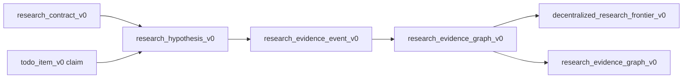

# auto_research_lane_contract_v1

`auto_research_lane_contract_v1` defines how LoopX runs auto research with
several independent agent lanes over one shared control plane. It is a role and
capability contract, not a new coordinator service.

The contract answers one product question: how can a user get an Arbor-style
research loop while LoopX stays decentralized?

## Design Principles

- The source of truth is the LoopX graph: todos, claims, rollout events,
  evidence packets, gates, and read-only projections.
- Lanes contribute typed records. They do not own the full research tree.
- Selection is local to the requesting agent through
  `quota should-run --agent-id ...`.
- Promotion is a policy decision over evidence, not a persuasive summary.
- Advisory lanes may shape hypotheses, but only evidence lanes can promote or
  retire hypotheses.

## Lane Roles

| Role | Capability token | Primary contribution | Writes | Must not |
| --- | --- | --- | --- | --- |
| Curator | `research_curator` | Defines or refreshes the public-safe research contract, metric, protected scope, and novelty boundary. | `research_contract_v0`, grounding refs. | Select winners, edit protected evaluators, or own executor queues. |
| Hypothesis proposer | `hypothesis_proposer` | Proposes grounded, todo-backed hypotheses and parent-child refinements. | `research_hypothesis_v0`, agent todos, grounding refs. | Claim novelty from the same material used for ideation. |
| Executor | `research_executor` | Runs one claimed hypothesis in an isolated worktree and produces split-aware results. | branch refs, eval result projections, `auto_research_evidence_packet_v0`. | Mutate protected scope, promote results, or hide failed attempts. |
| Evaluator / promoter | `evaluator_promoter` | Converts scored attempts into promotion, retry, or retirement candidates under the contract policy. | `research_evidence_event_v0`, promotion or retirement candidate projections, gate todos. | Treat dev-only lift as promoted evidence or bypass owner gates. |
| Product narrator | `product_narrator` | Renders the public-safe case story from projections for downstream product surfaces. | `research_evidence_graph_v0`, public docs, screenshots after first-screen review when needed. | Invent metrics, read private source bodies, or mutate source state. |

No lane is privileged. A single Codex session may implement more than one role
when it has the matching todo claim and boundary, but the graph must still show
which capability produced which record.

## Lane Claim Packet

Each lane action should be representable as a compact claim packet. This packet
can live in a todo metadata projection, a rollout event detail, or a future
kernel API, but it must remain public-safe.

```json
{
  "schema_version": "auto_research_lane_claim_v1",
  "goal_id": "loopx-auto-research-demo",
  "lane_role": "research_executor",
  "agent_id": "research-executor",
  "todo_id": "todo_auto_research_demo_001",
  "hypothesis_id": "hyp_state_a2a_round",
  "capability_token": "research_executor",
  "allowed_actions": ["run_dev_attempt", "run_holdout_attempt", "write_evidence_packet"],
  "write_scope": ["auto_research_evidence_packet_v0", "rollout_event_log"],
  "blocked_by": []
}
```

The claim packet is not a lock on the full graph. It only explains why this
agent may take the next bounded action.

## Source And Projection Flow



The graph can be rendered as a tree, but it is not owned by a tree manager. A
lane appends or updates the smallest source record it is authorized to touch;
projection builders derive frontiers and product views afterward.

Successor work should stay equally small. A role profile may declare a
`successor_todos` rule such as "after `run_dev_eval`, if dev evidence is
supported and no holdout exists, add `run_holdout_eval` for
`research-executor`." The pane-local tick applies that declaration by writing a
normal LoopX todo with `claimed_by`, `action_kind`, and `unblocks_todo_id`.
The next agent still re-enters through its own `quota should-run` and frontier;
there is no separate continuation projector or central research manager.

## Capability Rules

1. A `research_curator` may create or amend `research_contract_v0` only inside
   allowed docs/example scopes and with protected scope explicitly named.
2. A `hypothesis_proposer` may create a hypothesis only when it is backed by an
   agent todo and has `claimed_by`, `todo_id`, `mechanism_family`, and
   grounding refs or a clear no-grounding reason.
3. A `research_executor` may run only the hypothesis selected by current
   agent-scoped quota or an explicitly claimed role-declared successor todo.
4. An `evaluator_promoter` may promote only when dev evidence, held-out
   evidence, clean boundary, and required gates are present.
5. A `product_narrator` may publish only from `research_evidence_graph_v0`
   and related public-safe refs; first-screen public surface changes still obey
   the first-screen review gate.

## Gates

| Gate | Applies to | Required signal |
| --- | --- | --- |
| Protected boundary gate | Executor and promoter | `protected_scope_clean=true`, no protected file edits. |
| Held-out gate | Promoter | Held-out metric improves under the contract direction. |
| Novelty gate | Promoter or narrator | Independent novelty audit ref when claiming research novelty. |
| Owner gate | Promoter or public narrator | Explicit user/controller gate when merge, publication, or private boundary requires one. |
| First-screen gate | Product narrator | Preview before changing first viewport, hero, primary CTA, or opening nav. |

## Promotion And Retirement

Promotion and retirement are both useful outcomes:

- promotion candidate: supported or promoted hypothesis with public-safe dev
  evidence, required holdout/boundary checks, and a todo/branch/evidence ref;
- retirement candidate: contradicted or retired hypothesis, negative evidence,
  guardrail failure, or repeated retry exhaustion;
- retry candidate: unscored but resumable attempt with a branch/ref and
  `needs_retry` evidence.

The product board should show all three. The user should see which result is
worth merging, which direction saved future search time by failing clearly, and
which attempt needs another bounded executor turn.

## Acceptance Checks

An implementation satisfies this lane contract when:

- every lane role above is present as a named capability;
- every executable hypothesis has `todo_id`, `claimed_by`, and agent-scoped
  quota selection;
- promotion and retirement candidates are derived from
  `research_evidence_graph_v0`, not fixture-only prose;
- grounded ideation and novelty audit remain separate lanes;
- no public surface needs a leader or coordinator agent to explain ownership;
- public docs and projections contain no raw logs, private paths, credentials,
  internal documents, or raw protected evaluator material.
